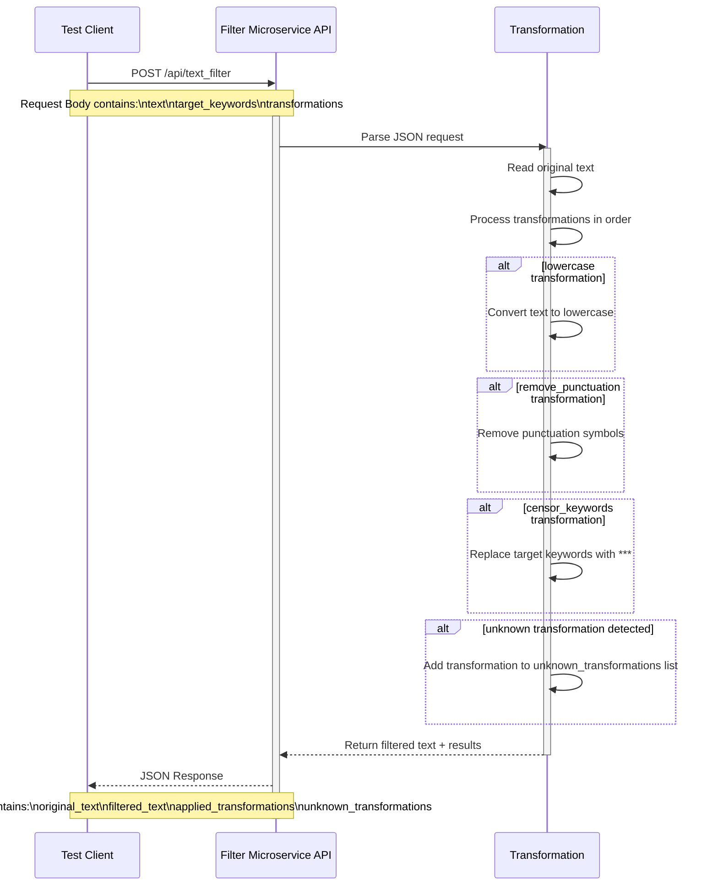

# cs361-filter-microservice

This microservice accepts a text string, performs requested transformations in the order they were requested and returns the modified text.

## Dependencies

This microservice requires:

- Python 3
- Flask
- requests

## How to request data

Send a POST request to:
```text
/api/text_filter
```
The body must contain:
- "text": a string, the text to be filtered or modified
- "target_keywords": a list of keywords for some transformations to act upon
- "transformations": a list of desired transformations/filters to apply to the text, performed in the order listed

### Example Python Request

```python
import requests, json

url = "http://127.0.0.1:5000/api/text_filter"

body = {
    "text": "This is a VERYBADWORD example!@#$",
    "target_keywords": ["verybadword"],
    "transformations": [
        "lowercase",
        "remove_punctuation",
        "censor_keywords",
        "a_fake_transformation"
    ]
}

response = requests.post(url, json=body)

print(json.dumps(response.json(), indent=4))
```

## How to receive data

The microservice returns a JSON response.

The response contains:
- "original_text": The original, unmodified text sent in the request
- "filtered_text": The text after being modified by any transformation in "applied_transformations"
- "applied_transformations": A list of successfully applied transformations, in the order they were performed
- "unknown_transformations": A list of invalid or unsupported requested transformations

### Example response
```json
{
    "original_text": "This is a VERYBADWORD example!@#$",
    "filtered_text": "this is a *** example",
    "applied_transformations": [
        "lowercase",
        "remove_punctuation",
        "censor_keywords"
    ],
    "unknown_transformations": [
        "a_fake_transformation"
    ]
}
```

## UML Sequence Diagram


